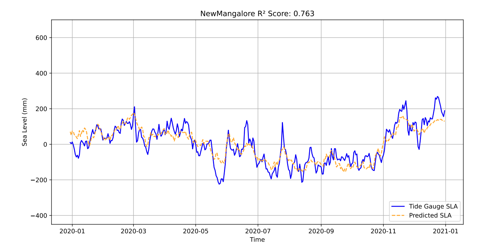

# **Sea Level Prediction Using Stacked Ensemble Machine Learning**

## **Overview**
This repository contains an advanced **ensemble machine learning model** for predicting sea level variations. The model leverages multiple techniques, including **Random Forest, Gradient Boosting (XGBoost, CatBoost), and ElasticNet**, combined using a **stacked ensemble approach**. Hyperparameter optimization is performed using **Optuna**, and **SHAP analysis** is employed for feature importance evaluation.  

🚀 **Key Highlights:**
- **Stacked ensemble model** combining multiple machine learning algorithms.
- **Time-series cross-validation** ensures robust model performance.
- **Hyperparameter tuning with Optuna** for optimal settings.
- **SHAP analysis** for model explainability.
- **Demo dataset used** (original dataset is confidential from INCOIS).


---

## **Table of Contents**
1. [Introduction](#introduction)
2. [Implementation Details](#implementation-details)
3. [Model Architecture](#model-architecture)
4. [Results](#results)
5. [Files](#files)
6. [Repository Structure](#repository-structure)
7. [Future Enhancements](#future-enhancements)

---

## **Introduction**
Sea level rise is a critical challenge in coastal management and climate research. Traditional models often suffer from **high variance** and **bias** due to complex ocean dynamics. **This project applies ensemble learning to enhance prediction accuracy and stability.**  

### **Why Ensemble Learning?**
✅ Reduces model variance by combining multiple learners.  
✅ Improves robustness against overfitting.  
✅ Captures complex relationships between oceanographic variables.  

### **Project Objectives:**
🔹 Predict sea level variations using a data-driven approach.  
🔹 Implement **bagging, boosting, and stacking** ensemble methods.  
🔹 Optimize hyperparameters for **high predictive accuracy**.  

---

## **Implementation Details**
The **stacked ensemble model** integrates predictions from **multiple base learners** and combines them using a **meta-learner (ElasticNet)**.  

### **Machine Learning Models Used:**
- **Base Models:**
  - Random Forest 🌳
  - XGBoost ⚡
  - CatBoost 🐱📊
  - ElasticNet 📈

- **Ensemble Techniques:**
  - **Bagging** (Bootstrap Aggregating)
  - **Boosting** (XGBoost, CatBoost)
  - **Stacking** (Meta-learning for optimal predictions)

### **Pipeline Workflow**
1. **Data Preprocessing:** Handling missing values, feature scaling (StandardScaler), and feature engineering (moving averages, lag variables).  
2. **Model Training:** Base models are trained and optimized with **Optuna**.  
3. **Ensemble Integration:** Predictions from base models are combined using **stacking**.  
4. **Evaluation:** Performance is measured using **MAE, RMSE, and R² score**.  
5. **Model Interpretability:** **SHAP analysis** provides insights into feature importance.  
6. **Prediction & Visualization:** Generates **sea level forecasts** and visualizes trends.  

---
```markdown
## **Model Architecture**

```mermaid
graph TD;
    A[Input Data] --> B[Feature Engineering];
    B --> C[Train Base Models];
    C --> D[Random Forest];
    C --> E[XGBoost];
    C --> F[CatBoost];
    D --> G[Ensemble Stacking];
    E --> G;
    F --> G;
    G --> H[Meta Learner (ElasticNet)];
    H --> I[Final Prediction];
---

## **Results**

###📊 **Performance Metrics:**  



- **R² Score:** 0.8-0.9 on an avg for entire stations .

### 🔍 **Feature Importance (SHAP Analysis)**  

The SHAP summary plot provides insights into the most influential features contributing to sea level changes:  

- **Upper Ocean Heat Content (`thetao_m3`)** has a strong positive impact on sea level rise. Higher heat content values correspond to higher SHAP values, indicating that increased ocean temperature significantly contributes to sea level changes.  
- **Upper Ocean Salt Content (`so_m3`)** also plays a crucial role. Lower salinity values often correspond to rising sea levels, likely due to freshwater input from melting ice or precipitation-driven dilution.  
- **Alongshore Ocean Currents (`V_eta`) and Cross-shore Ocean Currents (`V_xi`)** influence sea level variations by redistributing water masses across different regions.  
- **Alongshore Ekman Transport (`M_eta`) and Cross-shore Ekman Transport (`M_xi`)** drive large-scale water movement, impacting coastal sea level fluctuations.  
- **River Discharge (`dis24`)** affects local sea level anomalies, particularly in coastal zones, by altering freshwater input.  

These findings highlight that **Upper Ocean Heat Content and Upper Ocean Salt Content** are the dominant drivers in our model, with ocean currents and external forcing mechanisms adding further variability.  

📌 **Insights:**
- Stacking improves prediction accuracy over single models.
- SHAP analysis helps in identifying the most significant predictors.

---

📝 **Note:** This repository uses a **demo dataset** due to confidentiality agreements with **INCOIS**. The original dataset cannot be shared publicly. However, the methodology and model can be reproduced using similar data sources.

